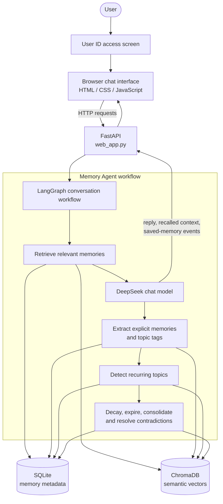

# Memory Agent

Memory Agent is a conversational AI assistant that remembers useful context across chats. It stores explicit preferences, facts, events, and corrections; retrieves the most relevant details for each new question; and gradually decays or consolidates old memories.

The project includes a browser interface with a user-ID access screen. Each user ID has an isolated memory space.

## Features

- Chat with a DeepSeek-powered assistant.
- Enter a user ID to access a separate conversation and memory profile.
- Extract durable memories from user messages only.
- Recall relevant memories using semantic search, recency, and importance.
- Detect recurring technical interests and save them as inferred preferences.
- Mark contradictory memories as superseded.
- Decay, expire, and consolidate old low-value memories.
- View active memories and their importance directly in the web interface.

## Tech stack

- Python and FastAPI
- LangGraph and LangChain
- DeepSeek chat model
- SQLite for memory metadata
- ChromaDB and Sentence Transformers for vector search
- Vanilla HTML, CSS, and JavaScript frontend

## Project structure

```text
MemoryAgent/
├── core/
│   ├── extraction.py          # Extracts memories and conversation topics
│   ├── forgetting.py          # Memory decay, expiry, consolidation, contradictions
│   ├── graph.py               # LangGraph conversation workflow
│   ├── pattern_detection.py   # Detects repeated topics
│   ├── retrieval.py           # Scores and retrieves relevant memories
│   └── storage/
│       ├── metadata_store.py  # SQLite memory metadata
│       └── vector_store.py    # Chroma vector storage
├── frontend/
│   ├── index.html             # Browser interface
│   ├── styles.css             # Responsive UI styling
│   └── app.js                 # Browser chat and memory interactions
├── data/                      # Created at runtime; local databases and vectors
├── tests/test_evaluation.py   # LLM evaluation scenarios
├── main.py                    # Original terminal chat interface
├── web_app.py                 # FastAPI server for the browser interface
└── requirements.txt
```

## Architecture



Every memory record is associated with the supplied user ID. This lets the retrieval and storage layers keep one user’s context separate from another’s.

## Setup

### 1. Create and activate a virtual environment

In PowerShell, from the project folder:

```powershell
python -m venv .venv
.\.venv\Scripts\Activate.ps1
```

### 2. Install dependencies

```powershell
pip install -r requirements.txt
```

### 3. Configure DeepSeek

Create a `.env` file in the project root and add your key:

```env
DEEPSEEK_API_KEY=your_deepseek_api_key
```

Optional configuration:

```env
DEEPSEEK_MODEL=deepseek-v4-flash
EMBEDDING_MODEL=sentence-transformers/all-MiniLM-L6-v2
```

## Run the web app

```powershell
uvicorn web_app:app --reload
```

Open [http://127.0.0.1:8000](http://127.0.0.1:8000) in your browser.

On the first screen, enter a user ID such as `alex_01`. A new ID begins with no saved memories. Entering the same ID again loads that profile’s existing memories.

## User IDs and privacy

User IDs keep memory records separate in the local database, but they are not passwords. This is suitable for a local prototype or trusted environment only. It does not prevent someone who knows another user’s ID from viewing that profile’s memories.

For a production deployment, add authenticated accounts, password hashing or OAuth, secure sessions, authorization checks, and a database-backed users table.

## Run the terminal app

The original command-line experience remains available:

```powershell
python main.py
```

It asks for a user ID, then starts a chat session. Type `exit` or `quit` to stop.

## Run evaluations

The evaluation suite makes real model calls, so it requires a valid API key and may incur provider costs.

```powershell
python tests/test_evaluation.py
```

It checks explicit preference recall, inferred topic patterns, contradiction handling, and avoidance of unrelated memory recall.

## How memory works

1. A user sends a message.
2. The app searches that user’s vector memories for relevant context.
3. It ranks matches using semantic similarity, recency, and importance.
4. The assistant responds with relevant context available to it.
5. The system extracts only durable facts explicitly stated by the user.
6. New memories are saved to SQLite and ChromaDB.
7. A maintenance job decays old memory importance, removes expired memories, consolidates eligible old memories, and removes stale topic tags.

## Local data

Runtime data is stored under `data/` and is ignored by Git. This includes the SQLite database, ChromaDB embeddings, and the last terminal user ID. Delete this directory only if you intentionally want to erase all local memory data.

## License

No license has been specified for this project.
